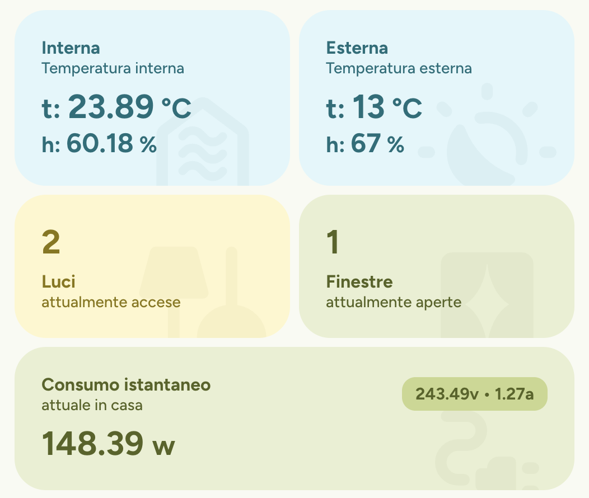
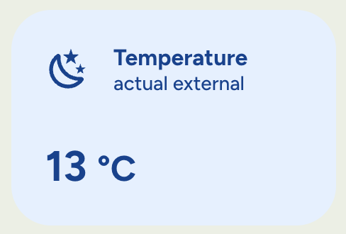
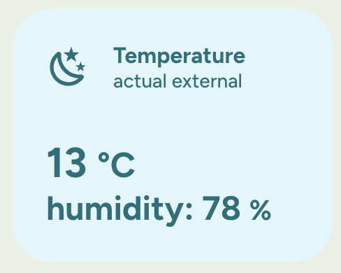
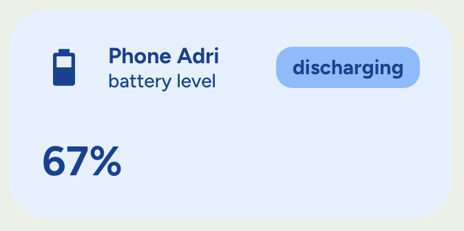
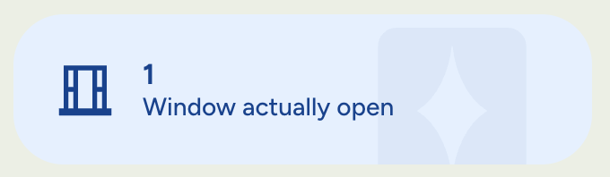
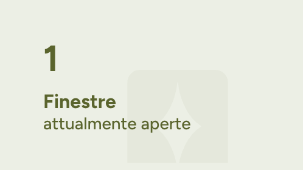
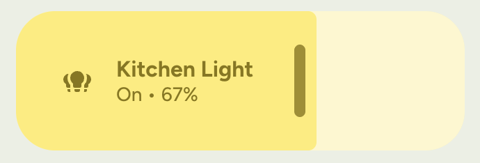
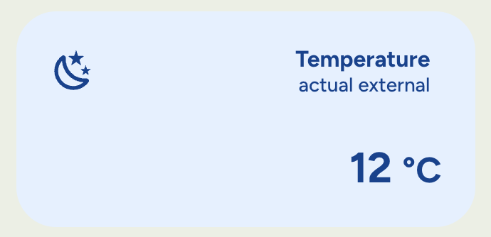
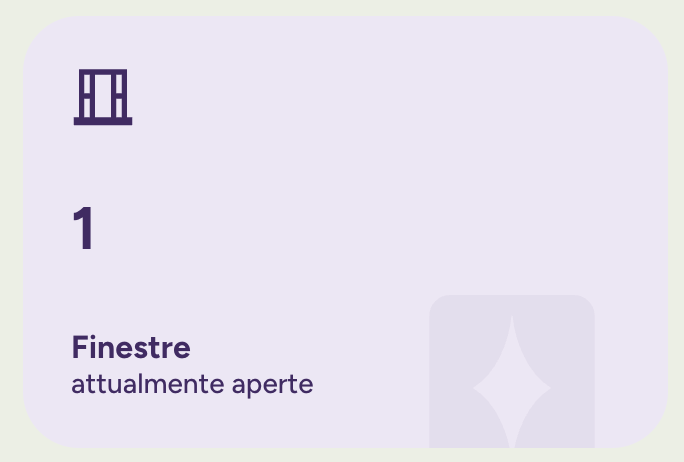
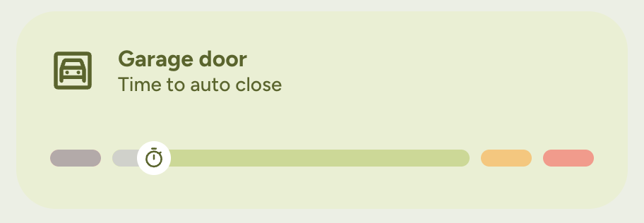

# .clay Template 🎨

Welcome to the **.clay** documentation, a versatile and highly customizable template for `custom:button-card` in Home Assistant. The goal of this template is to provide a solid, aesthetically clean, and functional foundation for creating modern and intuitive interfaces.

Inspired by the principles of Neumorphism and Material Design, Clay allows you to build dynamic cards that change their appearance and color based on entity states, with a wide range of customization options.



-----

## Prerequisites 📋

To use the clay template, some additional components are required. Some are essential for functionality, while others are recommended to achieve the best aesthetic result.

### Requirements

These components are **mandatory** for the template to work correctly.

* **Home Assistant**
* **HACS:** To easily install custom components.
* **[custom:button-card](https://github.com/custom-cards/button-card):** The engine the entire template is built upon. *Available on HACS.*
* **[custom:my-slider-v2](https://github.com/AnthonMS/my-cards/blob/main/docs/cards/slider-v2.md):** Used for slider controls (e.g., light brightness, cover position). *Available on HACS.*

### Recommended for the Best Experience

These components are not mandatory but are **recommended** to replicate the aesthetics shown in the screenshots and for a consistent visual experience.

* **[Material You Theme](https://github.com/Nerwyn/material-you-theme):** A Home Assistant theme that perfectly matches the template's style.
* **[Material Symbols](https://github.com/beecho01/material-symbols):** To have a modern and complete icon set available.
* **Figtree** font: A clean and readable font, easily importable from [Google Fonts](https://fonts.google.com/specimen/Figtree) into your theme.

-----

## Installation and Setup ⚙️

> **Note:** Installation is currently manual. I am working on making the template available via HACS to dramatically simplify the process.

Follow these steps to correctly install and configure the Clay template.

### Step 1: Add the Template File

1. Download the `clay.yaml` file from this repository.
2. Place the file in your Home Assistant configuration folder (e.g., `/config/`).
3. Open your Lovelace Dashboard configuration (in YAML mode or through the raw configuration editor) and include the file under the `button_card_templates` directive.

```yaml
# Example dashboard configuration
button_card_templates: !include clay.yaml

title: My Home
views:
  - ...
```

### Step 2: Configure the Theme Colors

The template is designed to use a dynamic color palette that you can customize.

1. Visit the **[Clay Color Generator](https://josephbalzanodev.github.io/.clay/generator/)** hosted on GitHub.
2. Enter the base colors you prefer. The generator will automatically create three variants (background, contrast, accent) for each color, for both the `light` and `dark` themes.
3. Copy the generated YAML code.
4. Open your theme file (e.g., `themes/my_theme.yaml` or `themes/.../material_you.yaml` if you are using the theme suggested above) and paste the generated variables under the `modes` section, as shown below:

```yaml
my_theme:
  # ... other theme settings ...
  modes:
    light:
      # Paste the generated variables for LIGHT mode here   
      clay_sage_bg: rgb(233, 239, 209)
      clay_sage_accent: rgb(87, 100, 35)
      clay_sage_contrast: rgb(201, 216, 143)

      clay_cyan_bg: rgb(228, 241, 255)
      clay_cyan_accent: rgb(0, 70, 145)
      clay_cyan_contrast: rgb(131, 191, 255)
      # ... etc ...
    dark:
      # Paste the generated variables for DARK mode here
      clay_sage_bg: rgb(87, 100, 35)
      clay_sage_accent: rgb(201, 216, 143)
      clay_sage_contrast: rgb(116, 133, 46)

      clay_cyan_bg: rgb(0, 70, 145)
      clay_cyan_accent: rgb(131, 191, 255)
      clay_cyan_contrast: rgb(0, 93, 193)
      # ... etc ...
```

### Step 3: Use the Template

Once the installation is complete, you can start using the template in your cards. The basic configuration is very simple:

```yaml
type: custom:button-card
template: .clay
entity: light.soggiorno
```

-----

## Configuration: Custom Fields 🖋️

Clay uses `custom_fields` to position specific elements within the card's grid. While many customizations are done via `variables`, some fields are exposed to allow for even more granular control over the displayed text.

It's important to distinguish between `custom_fields` intended for user customization and those used for the template's internal logic.

### Summary Table

| Custom Field      | Editable?              | Description                                                                         |
|-------------------|------------------------|-------------------------------------------------------------------------------------|
| `vstate`          | ✅ **Yes**              | The field for the main state. Highly customizable.                                  |
| `vprestate`       | ✅ **Yes**              | The field for the sub-state (or secondary state). Highly customizable.              |
| `badge`           | ✅ **Yes**              | Allows defining a badge with complex logic, as an alternative to `variables.badge`. |
| `slider`          | ⚠️ **Not Recommended** | Managed internally by the template's logic. Use the `slider` variable.              |
| `background_icon` | ⚠️ **Not Recommended** | Managed internally. Use the `background_icon` variable.                             |
| `progress_bar`    | ⚠️ **Not Recommended** | Managed internally. Use the variables starting with `progress_`.                    |

-----

### Custom Fields Details

#### `vstate`

This is the field that displays the entity's main state. By default, it shows the entity's state (e.g., "on", "off", "23.5 °C"), but it is hidden if a `progress_bar` is active to avoid overlaps. You can override it to display any information you want, including using JavaScript templates.

**Example:** Display the temperature from a weather sensor with a humidity attribute.

```yaml
type: custom:button-card
template: .clay
entity: weather.mysensor
variables:
  color: cyan
name: Temperature
label: actual external
custom_fields:
  vstate: "[[[ return `${entity.attributes.temperature} <small>°C</small>` ]]]"
```



-----

#### `vprestate`

This field is designed to show secondary information, or a "sub-state". It's empty by default, and you can use it to add contextual details to the card, such as humidity, the last update time, or any other attribute.

**Example:** Show the time of the last state change.

```yaml
type: custom:button-card
template: .clay
entity: weather.mysensor
variables:
  color: marine
  vstate_order: inverted
name: Temperature
label: actual external
custom_fields:
  vstate: "[[[ return `${entity.attributes.temperature} <small>°C</small>` ]]]"
  vprestate: "[[[ return `humidity: ${entity.attributes.humidity} <small>%</small>` ]]]"

```



-----

#### `badge`

This field allows you to add a badge (a small icon or text in a corner) to the card. It's a more powerful alternative to the `variables.badge` variable, as you can use complex JavaScript logic here to determine what to display.

**Example:** Show a battery icon if the level is below 20%.

```yaml
type: custom:button-card
template: .clay
entity: sensor.phone
name: Phone Adri
label: battery level
custom_fields:
  badge: discharging
  vstate: |
    [[[
      return entity.state + '%';
    ]]]
```



-----

#### ⚠️ `slider`, `background_icon`, `progress_bar`

These `custom_fields` are used **internally** by the Clay template to render complex components.

- **`slider`**: It is populated automatically when `variables.slider` is `true` (or calculated as such).
- **`background_icon`**: It is created when the `variables.background_icon` variable is used.
- **`progress_bar`**: It contains all the logic for the progress bar and is activated via `variables.progress: true`.

**Directly modifying these fields is strongly discouraged** as it could break the template's logic and lead to unexpected results. To control these features, please always use the dedicated **variables** documented in the next section.

-----

## Configuration: Variables 🎨

Clay's true potential lies in its flexibility. Below is a list of all the variables you can use to customize each individual card.

### Summary Table

| Variable                 | Data Type | Default Value  | Description / Supported Values                                                  |
|--------------------------|-----------|----------------|---------------------------------------------------------------------------------|
| **Layout & Style**       |           |                |                                                                                 |
| `layout_type`            | String    | `base`         | `base`, `inline`                                                                |
| `card_margin`            | String    | `24px`         | Any valid CSS value (e.g., `16px`, `0px`)                                       |
| **Colors**               |           |                |                                                                                 |
| `color`                  | String    | `cyan`         | Name of the color configured in the theme (e.g., `red`, `green`)                |
| `colored_bg`             | Boolean   | `true`         | If `false`, the card background is transparent                                  |
| `color_by_state`         | Boolean   | `false`        | If `true`, the card turns gray when the entity is "off"                         |
| `disable_color`          | String    | `gray`         | Color to use for the "off" state when `color_by_state` is `true`                |
| **Alignment**            |           |                |                                                                                 |
| `align_states`           | String    | `start`        | `start`, `center`, `end`                                                        |
| `align_titles`           | String    | `start`        | `start`, `center`, `end`                                                        |
| `vertical_align_titles`  | String    | `up`           | `up`, `down`                                                                    |
| `vertical_align_icon`    | String    | `up`           | `up`, `down`                                                                    |
| `vertical_align_badge`   | String    | `up`           | `up`, `down`                                                                    |
| `vstate_space`           | String    | `32px`         | CSS space above/below the states block                                          |
| **Visibility & Content** |           |                |                                                                                 |
| `info_by_type`           | Boolean   | `false`        | If `true`, icons and labels are auto-configured for certain domains             |
| `icon_visible`           | Boolean   | `true`         | Shows or hides the main icon                                                    |
| `label_visible`          | Boolean   | `true`         | Shows or hides the label                                                        |
| `name_visible`           | Boolean   | `true`         | Shows or hides the name                                                         |
| `icon_dim`               | String    | `32px`         | Icon size in pixels                                                             |
| `badge`                  | String    | `null`         | Text or icon to display in the badge                                            |
| **States**               |           |                |                                                                                 |
| `vstate_order`           | String    | `normal`       | `normal`, `inverted` (inverts the order of states)                              |
| `vstate_dimension`       | String    | `normal`       | `small`, `medium`, `big`                                                        |
| **Controls**             |           |                |                                                                                 |
| `slider`                 | Boolean   | *(Dynamic)*    | Shows a slider (defaults to `true` for dimmable lights and positionable covers) |
| **Progress Bar**         |           |                |                                                                                 |
| `progress`               | Boolean   | `false`        | Shows a circular progress bar                                                   |
| `start_time_attribute`   | String    | `last_changed` | Entity attribute for the progress start time                                    |
| `progress_duration`      | Number    | `3600`         | Total progress duration in seconds                                              |
| `segments_value`         | String    | `100`          | Segment subdivision (e.g., `80 20`)                                             |
| `segments_colors`        | String    | *(Dynamic)*    | Segment colors (e.g., `sage marine`)                                            |

-----

### Variables Details

> ⚠️ **Note on Internal Variables (`zzz_`)**
> Within the template's code, you will notice variables whose names begin with the `zzz_` prefix. These are **not intended to be modified directly by the user**; they are internal variables essential for the proper functioning of the template's logic.
>
> **Why this unusual name?** The `custom:button-card` processes variables in alphabetical order. Using `zzz_` is a technical workaround to ensure that these internal variables are processed *last*, only after all other configuration variables (like `color`, `layout_type`, etc.) have been defined.
> This ensures that the internal calculations have access to the correct values provided by you.
>
> In the future, if the `button-card` mechanism changes, a migration to a more standard naming convention for "private" variables, such as `_<variable_name>`, is planned.

-----

#### `layout_type`

Determines the main layout of the elements in the card.

- `base`: Standard layout with vertically arranged elements, ideal for square or rectangular cards.
- `inline`: Compact layout with horizontally arranged elements, perfect for lists or bars.

```yaml
type: custom:button-card
template: .clay
entity: sensor.window_open
# ...
variables:
  layout_type: inline
  background_icon: m3rf:curtains
  color: cyan
```



-----

#### `color`

Defines the main color of the card. It must correspond to one of the color sets you generated and added to your `theme.yaml` file.

```yaml
type: custom:button-card
template: .clay
entity: cover.tapparella_sala
variables:
  color: amber
```

-----

#### `colored_bg`

If set to `false`, the card's background will become transparent, leaving only the content (icon, text, etc.) visible. Useful for integrating the card into complex layouts.

```yaml
type: custom:button-card
template: .clay
entity: sensor.window_open_count
variables:
  colored_bg: false
  # ...
  color: sage
```



-----

#### `color_by_state`

If set to `true`, the card will use the color defined in `disable_color` (default `gray`) when the entity's state is `off`, `false`, `closed`, or `unavailable`. It maintains the main color for all other states.

```yaml
type: custom:button-card
template: .clay
entity: binary_sensor.garage_door
variables:
  color_by_state: true
  color: red
  disable_color: gray
```

-----

#### `info_by_type`

If set to `true`, the template will attempt to automatically configure the icon and label based on the entity's domain.
Works for: `light`, `cover`, `window`, `climate`.

```yaml
type: custom:button-card
template: .clay
entity: climate.my_climate
variables:
  info_by_type: true
```

-----

#### `slider`

Shows a slider control, useful for entities like dimmable lights or positionable covers.
The default value is dynamic: `true` if the entity is a dimmable light or a positionable cover, otherwise `false`.

```yaml
type: custom:button-card
template: .clay
entity: light.kitchen_light
variables:
  slider: true # This is redundant in this case, as it would already default to true
```



-----

#### `align_states` & `align_titles`

Control the horizontal alignment of titles (`name` and `label`) and states (`state` and `prestate`).
Supported values: `start` (left), `center`, `end` (right).

```yaml
type: custom:button-card
template: .clay
entity: sensor.climate
variables:
  align_titles: end
  align_states: end
```



-----

#### `vertical_align_titles`, `vertical_align_icon`, `vertical_align_badge`

Control the vertical positioning of titles, icon, and badge.

- `up`: Positions the element at the top of the card.
- `down`: Positions the element at the bottom of the card.


```yaml
type: custom:button-card
template: .clay
entity: person.mario
variables:
  vertical_align_badge: down
  vertical_align_titles: down
  vertical_align_icon: up
  color: violet
```



-----

#### `progress`

If set to `true`, it displays a circular progress bar around the card. It is highly configurable with the subsequent variables.

```yaml
type: custom:button-card
template: .clay
entity: sensor.garage_door
variables:
  progress: true
  start_time_attribute: last_changed # Or the attribute containing the ISO timestamp
  progress_duration: 300 # 5 minutes
```



-----

#### `segments_value` & `segments_colors`

Allow splitting the progress bar into colored segments.

- `segments_value`: A string of space-separated numbers whose sum must be 100 (e.g., `"80 20"`).
- `segments_colors`: A string of space-separated color names (from the theme), equal in number to the segments (e.g., `"green red"`).


```yaml
type: custom:button-card
template: .clay
entity: sensor.livello_batteria_robot
variables:
  progress: true
  segments_value: "10 70 10 10"
  segments_colors: "red sage orange red"
```


